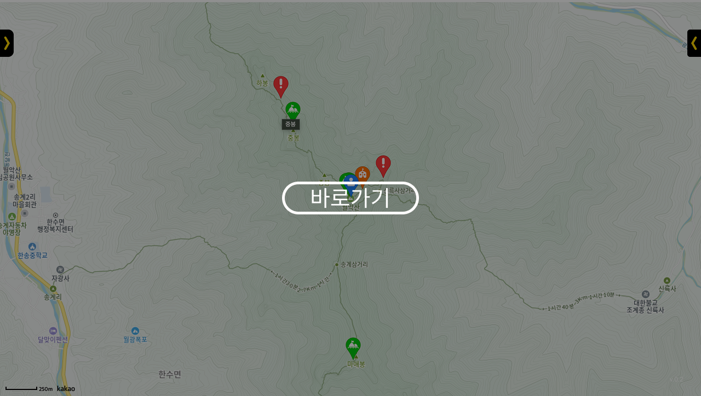
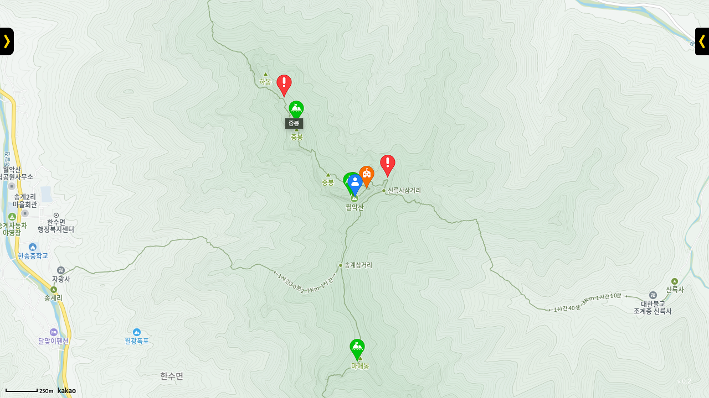

# ⛰️ Safe Hiking Tour

[](https://safe-hiking-tour.vercel.app)


등산 위험지역 웹 지도 서비스입니다.

등산 위험지역, 대피소, 봉우리 위치 정보와 주변 관광지 정보를 웹 지도를 통해 살펴볼 수 있고, 등산 챗봇을 통해 등산 관련 정보를 빠르게 찾아볼 수 있습니다.

## 📆 프로젝트 기간
- **초기 개발:** 2024.6 - 2020.9 (React.js 기반)
- **업그레이드:** 2025.4 - 2025.5 (Next.js로 변경)

## 👨‍💻 역할
- 1인 개발 (Full-Stack Development)

## 🛠️ 사용 기술
- **Full-Stack**: React.js → Next.js (2025년 변경)
- **API**: Kakao map API, 국문 관광정보 서비스 API, Gemini API, 한국등산트레킹지원센터 API(Python으로 전처리 후 사용)

## 🚀 섹션별 설명
- **카카오 맵**: 등산 위험지역, 대피소, 봉우리의 위치정보를 지도를 통해 표출. 위치 검색 시, 해당 위치 표출.



## 📌 설치 및 실행 방법
```sh
# 1. 프로젝트 클론
git clone https://github.com/moonjiuk/to-the-moon.git
cd to-the-moon

# 2. 패키지 설치
npm install

# 3. 개발 서버 실행
npm run dev

